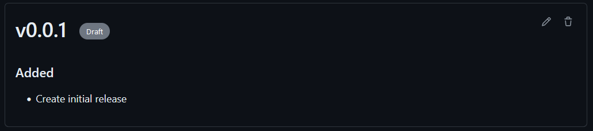

# Draft release workflow

This is an idea on how to automate releases based on an editable draft.
The concept is inspired on following requirements/issues:
- The version and changelog for a release are defined in the same place. In this case, a draft release. 
- Code changes regarding version and changelog (gradle, CHANGELOG.md) are automated. No additional manual work required.
- A release artifact is uploaded as an asset-attachment. It has to contain the changelog.

# Concept
>- There can only be one active draft!
- After every successful build on the main branch, a draft release is created with all commits since the last tag as a "template" changelog. 
- To start the release process, adjust the version and the changelog in the draft and manually start the `Create release PR` workflow.
- A pull request is created which bumps the version and updates the changelog to the values defined in the draft.
- When the PR is merged, the draft gets released and a release artifact, based on a gradle task, is uploaded.

### Flowchart

## Example
### Draft after commit to master

### Adjusted draft for first release

### Release PR after manually triggering 'Create release PR'

### Released draft with asset

